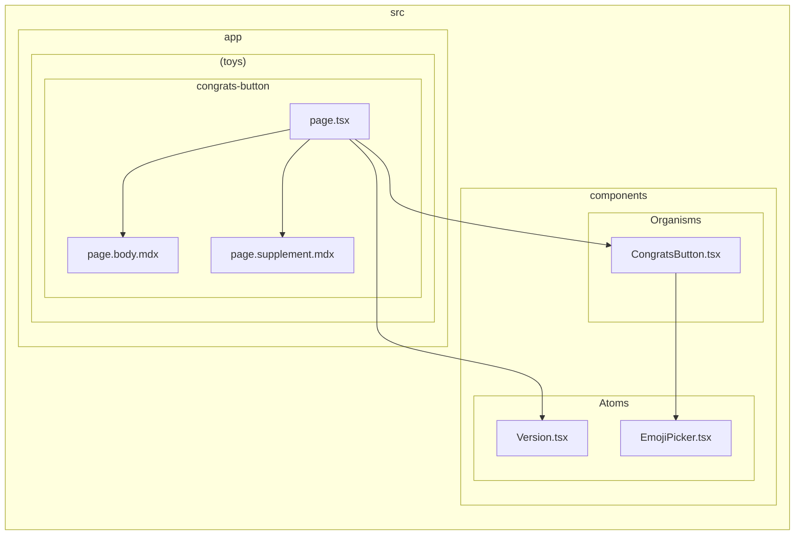

# KeM's Toys

Next.js や TypeScript などの練習用に作成したツール集です。

## Deploy

[Vercel](https://vercel.com) にてビルドおよびデプロイを行っています。

- [https://kems-toys.vercel.app](https://kems-toys.vercel.app)

サブドメインを登録したため、次の URL でもアクセスできます。

- [https://toys.kems-clew.net](https://toys.kems-clew.net)

## Memo

### 依存関係図を出力する

[`package.json`](package.json) > `"scripts"` にて定義しているコマンド。次のとおり使用する。

```shell
# .workbench/dependency-graph.svg へ書き出し
$ npm run d-graph:svg -path=./src/app/\(toys\)/congrats-button/page.tsx

# .workbench/dependency-graph.md へ mermaid 記法で書き出し
$ npm run d-graph:md -path=./src/app/\(toys\)/congrats-button/page.tsx
```

下図のように出力される。



## Reference

### Next.js

- [Next.js by Vercel - The React Framework](https://nextjs.org/)
  - [Getting Started: Installation \| Next.js](https://nextjs.org/docs/getting-started/installation)
  - [Configuring: Debugging \| Next.js](https://nextjs.org/docs/pages/building-your-application/configuring/debugging#debugging-with-vs-code)
  - [Configuring: MDX \| Next.js](https://nextjs.org/docs/app/building-your-application/configuring/mdx)
- [Setup Next.js with Airbnb ESLint, Prettier, TypeScript and Tailwind CSS \| Max Shen Dev](https://m4xshen.dev/posts/setup-nextjs-with-airbnb-eslint-prettier-typescript-and-tailwindcss/)
- [【完全版】Next.jsのSSG、SSR、ISR、CSRを図とコードでスッキリ理解する - らくらくエンジニア](https://rakuraku-engineer.com/posts/nextjs-app-ssgssr/)

### Styling

- [Tailwind CSS - Rapidly build modern websites without ever leaving your HTML.](https://tailwindcss.com/)
- [Tailwind CSS で要素やテキストを中央に寄せる方法 \| プログラミングと仕事論](https://shigotoron.com/tailwind-css-で要素やテキストを中央に寄せる方法/)
- [daisyUI — Tailwind CSS Components ( version 4 update is here )](https://daisyui.com/)
  - [daisyUI を Tailwind CSS プラグインとしてインストールします — Tailwind CSS Components ( version 4 update is here )](https://daisyui.com/docs/install/)
- [Rehype Pretty Code](https://rehype-pretty.pages.dev/)
- [Nextjsで@next/mdxを使ったマークダウンの変換でシンタックスハイライトを実装する \#Next.js - Qiita](https://qiita.com/KokiSakano/items/571130652864432b8489)

### Icons

- [Heroicons](https://heroicons.com/)

### ESLint

- [eslint-config-airbnb-typescript - npm](https://www.npmjs.com/package/eslint-config-airbnb-typescript)
- [eslint-config-airbnb - npm](https://www.npmjs.com/package/eslint-config-airbnb)

### Prettier

- [Prettier · Opinionated Code Formatter](https://prettier.io/)
  - [Install · Prettier](https://prettier.io/docs/en/install)
- [prettier-plugin-organize-imports - npm](https://www.npmjs.com/package/prettier-plugin-organize-imports)
- [prettier-plugin-organize-imports で import 文を自動フォーマットする](https://zenn.dev/wakamsha/articles/prettier-plugin-organize-imports)

### Dependency cruiser

- [ESLintだけでは守れない。Dependency cruiserによるアーキテクチャー保護](https://zenn.dev/hedrall/articles/f565147bee5da8)
- [dependency-cruiserについて理解する \#JavaScript - Qiita](https://qiita.com/yamatai12/items/fce4104e273981f78807)
- [Download \| Graphviz](https://graphviz.org/download/)
